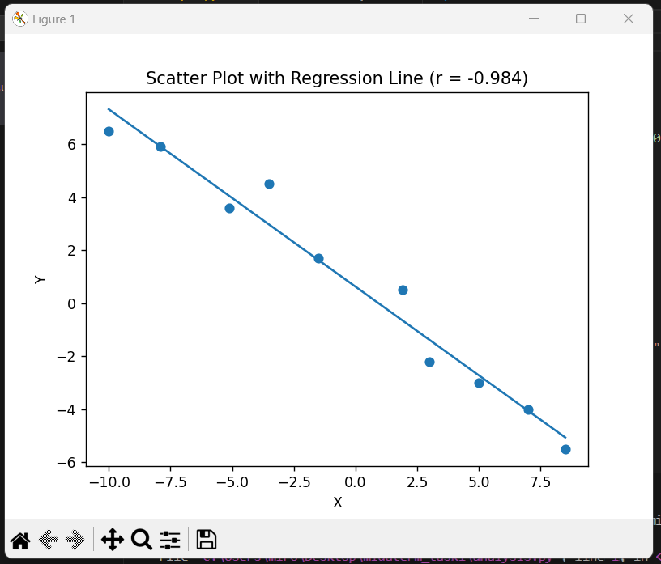

# Pearson Correlation Analysis

## Task Description
The goal of this task is to find **Pearson’s correlation coefficient** for a given dataset shown on an online graph and to visualize the relationship using a relevant plot.  
The solution must be reproducible using Python.

---

## Data Collection
The data points were obtained by hovering over each blue dot on the provided online graph and manually recording the displayed coordinates.

The extracted data points are:

| X | Y |
|---|---|
| -10.0 | 6.5 |
| -7.9 | 5.9 |
| -5.1 | 3.6 |
| -3.5 | 4.5 |
| -1.5 | 1.7 |
| 1.9 | 0.5 |
| 3.0 | -2.2 |
| 5.0 | -3.0 |
| 7.0 | -4.0 |
| 8.5 | -5.5 |

---

## Method
Pearson’s correlation coefficient measures the strength and direction of a linear relationship between two variables.

The following steps were performed:
1. Store the x and y values in NumPy arrays
2. Use NumPy’s built-in function to compute Pearson’s correlation coefficient
3. Generate a scatter plot of the data
4. Add a linear regression line to visualize the trend

---

## Result
The computed Pearson correlation coefficient is:

**r = -0.984**

This value indicates a **very strong negative linear correlation**, meaning that as x increases, y decreases almost linearly.

---

## Visualization
A scatter plot with a fitted regression line was generated to visually confirm the correlation.



---

## Reproducibility
To reproduce the results, run the following command:

```bash
python analysis.py
